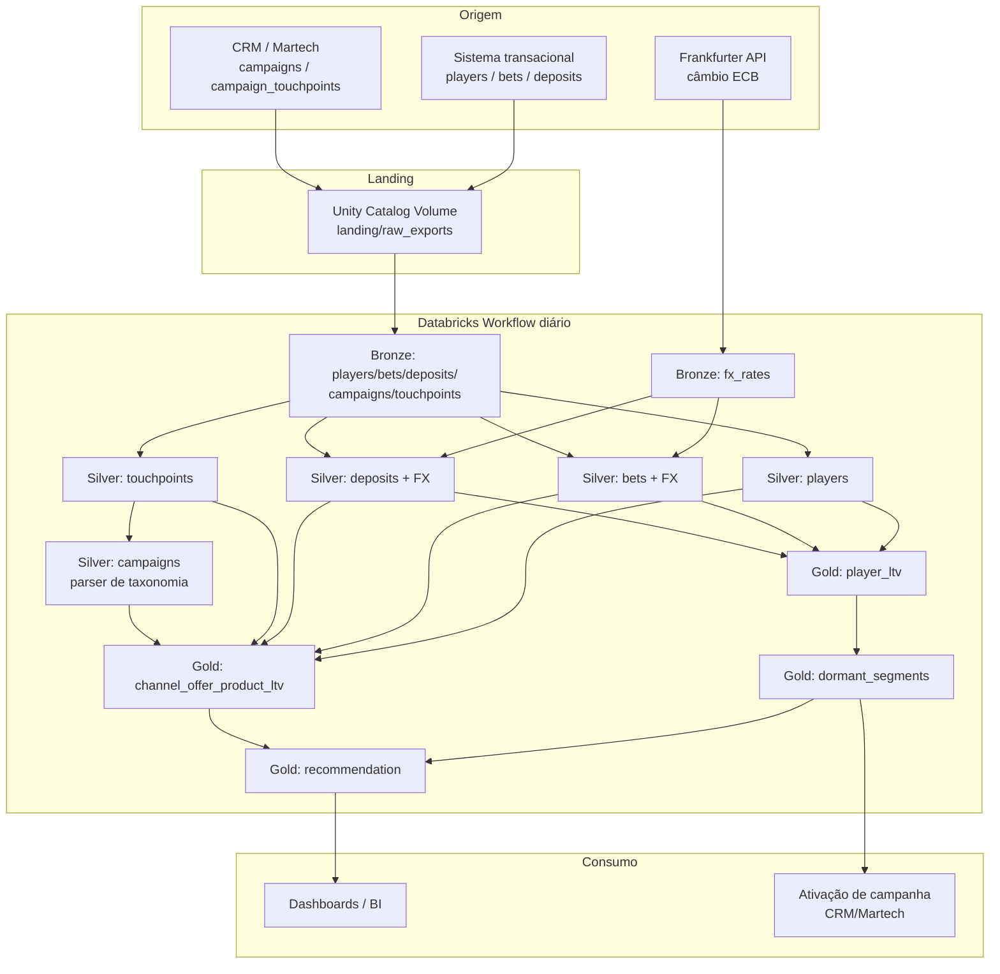

# Arquitetura de produção

Este documento descreve como o pipeline rodaria em produção de verdade — não só uma vez
num notebook — conforme pedido no item 3a.4 do guia do case.

## Visão geral

## Orquestração

- **Databricks Workflows** (Jobs) aponta para o repositório Git (Databricks Repos), não
  para uma cópia manual de notebooks — todo deploy é via merge na branch principal
  (CI/CD com GitHub Actions/Azure DevOps rodando `databricks bundle deploy` é o próximo
  passo natural, fora do escopo deste case por tempo).
- Cada notebook do repo vira uma **task** no grafo do Workflow, com `depends_on`
  explícito replicando a ordem já documentada em `02_execution`.
- **Agendamento:** diário, após a janela de corte do sistema de origem (ex.: 03:00 UTC).
  A tabela Gold fica pronta antes do horário comercial do time de Growth.
- **Cluster:** job cluster efêmero (não all-purpose) — sobe só para a execução, evita
  custo de cluster ocioso. Dado o volume atual (KBs), um cluster single-node já basta;
  o desenho em Spark/Delta garante que escalar para milhões de linhas não exige reescrever
  nada, só ajustar o cluster.

## Incrementalidade

O pipeline atual roda em modo `overwrite` (adequado ao volume do case). Em produção, com
volume real crescendo todo dia, a evolução natural seria:

- **Bronze:** Auto Loader (`cloudFiles`) para ingestão incremental dos exports do sistema
  de origem, com checkpoint de arquivo já processado — nunca reprocessa o mesmo arquivo
  duas vezes.
- **Silver/Gold:** `MERGE INTO` (upsert) por chave (`player_id`, `bet_id`, etc.) em vez de
  overwrite total, processando só a partição de data mais recente. Isso também abre
  caminho para Structured Streaming se a latência de horas deixar de ser suficiente.
- **FX rates:** cache incremental — só buscar da API as datas que ainda não existem na
  tabela Bronze, não o range inteiro toda vez (o notebook atual já isola essa lógica em
  uma função dedicada, então essa mudança é local a `bronze_fx_rates`).

## Qualidade e observabilidade

- **Testes de dado** (não implementados neste case por tempo, mas seriam o próximo passo):
  Delta Live Tables expectations ou Great Expectations rodando entre camadas — ex.:
  "nenhum `player_id` em `bets` sem correspondência em `players`", "`stake_brl` nunca
  nulo para moeda válida".
- **Alertas:** o Workflow notifica Slack/e-mail em falha de task. Uma falha na busca de
  câmbio (rede instável) não deveria travar Bronze de players/bets/deposits, que são
  independentes — por isso essas tasks não dependem uma da outra no grafo.
- **Auditoria:** colunas `_ingested_at` e `_source_file` em toda tabela Bronze/Silver já
  presentes no código atual são a base disso — qualquer linha é rastreável até a carga que
  a gerou.

## Governança de dado

- **Unity Catalog** com 3 catálogos (`dev`/`staging`/`prod`), já refletido em `00_config`.
- Permissões por schema: Bronze restrito a engenharia de dados (contém PII de jogador
  bruta); Gold liberado para o time de Growth/BI consumir via dashboard, sem acesso direto
  às camadas anteriores.
